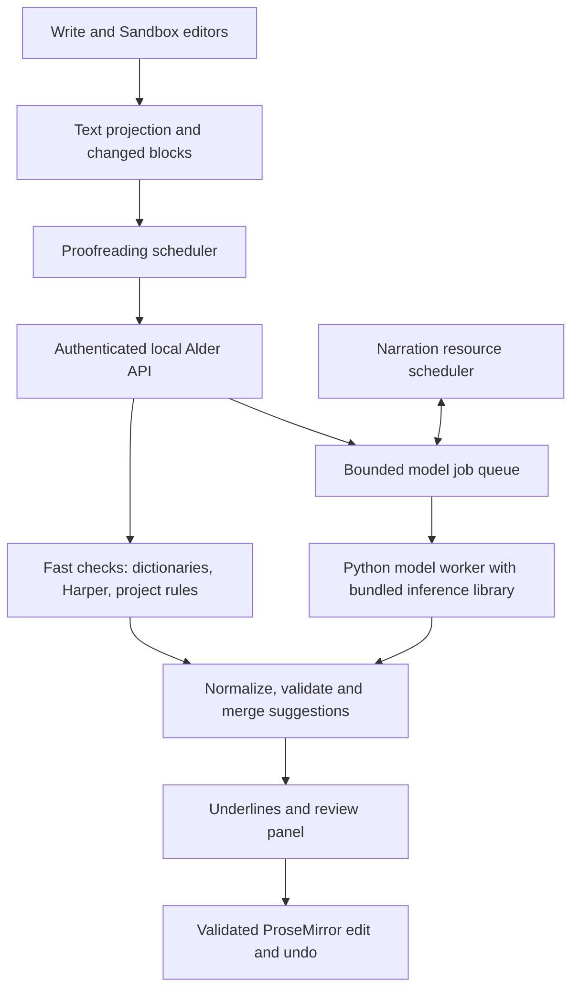

# Offline spelling and grammar for Alder

Planning baseline: Alder 0.11, inspected working copy, 20 September 2026. The design below records the original scope; implementation has now begun. See [the implementation and verification notes](offline-proofreading.md) for current behaviour and measured results.

**Completion status: incomplete.** Python service/workers, local rule/model adapters, AU/UK/US preferences, cancellable jobs, source-safe editor fixes, selection/chapter/book review, dictionaries, resource provisioning and initial verification are implemented. Windows development desktop checks and Linux rules/model probes have passed. The 18-example development benchmark is not a Grammarly-quality qualification.

The remaining release gates include independent editorial evaluation and comparator evidence, broader model selection/adaptation, real Mac verification and Intel Mac advanced packaging, reference-memory/GPU qualification, complete installed offline/update/rollback checks, cross-paragraph/incremental-review refinements, and the redistribution audit. Keep this plan until those requirements are completed; delete it at actual completion as requested.

The agreed scope is English with Australian, British and US conventions, on computers with 16–32 GB RAM and optional GPU acceleration. The service must integrate with Alder's Python backend and work on Windows, Linux and macOS. Alder-owned backend services, workers and adapters should be written in Python; the existing TypeScript editor remains the frontend. Spelling and grammar must operate locally without internet access after the required resources have been installed. An offline installation pack must also be possible.

## 1. Recommended direction

Build a layered proofreading system: a reliable dictionary checker for immediate spelling feedback; a rule engine for common grammatical and punctuation errors; and a local language model for corrections that depend on context. Preserve Alder's project vocabulary and custom rules across all three layers.

The initial engineering choice is **Python spelling and rule adapters + a quantized model loaded by a separate Python worker**. Use Hunspell dictionaries, evaluating the Python implementation Spylls against a packaged native binding. Access Harper through its packaged language server using a Python adapter, or select local LanguageTool if its Python integration and quality are better. The first model runtime candidate is `llama-cpp-python`, with Transformers/PyTorch as an alternative to benchmark. Benchmark Qwen3.5-4B and Qwen3.5-9B before choosing the shipped model. Benchmark Harper's own spelling as a simpler alternative to the separate dictionary checker; remove that component only if the simpler system meets the same spelling and dialect gates. Ship one winning rule engine by default.

Python is the implementation language for Alder's proofreading logic, not a requirement to reimplement numerical inference in pure Python. Established Python AI packages use compiled kernels internally. No Alder-owned C++ or Rust helper is required, and no end-user compiler should be required. If avoiding llama.cpp itself becomes a requirement, use the Transformers/PyTorch candidate, subject to the same memory, latency and platform tests; it also contains native dependencies.

This is a credible route to competitive offline checking. It is not evidence of Grammarly parity. Define and measure that target before committing to a quality claim. A larger model, or a model published by Grammarly, does not establish equivalence to the commercial product.

The central product decision is to distinguish **correctness** from **optional style advice**. Correctness covers spelling, word usage, agreement, tense, articles, prepositions, sentence boundaries, punctuation and related grammatical mistakes. Concision, tone, passive voice and sentence length are separate suggestions. Creative fragments, dialogue and deliberate repetition should remain usable without constant warnings.

## 2. What Alder currently provides

The source already supplies useful editor and runtime foundations, but the checking itself needs substantial replacement.

| Area | Observed implementation | Consequence for this work |
| --- | --- | --- |
| Spelling | `backend/alder/language.py::_speller()` creates `SpellChecker(language="en", distance=1)` using pyspellchecker. `analyze()` selects one correction, excludes all-uppercase tokens and accepts project vocabulary. | Limited candidate generation, no explicit AU/UK/US checking policy, and no contextual disambiguation. A valid word used incorrectly generally passes a dictionary check. |
| Grammar | `language.py::analyze()` implements repetition, phrase substitutions, sentence length/openings, spacing, brackets and custom literal rules. The `grammar` alias maps to `punctuation`. | There is no comprehensive agreement, tense, article or context-sensitive grammar engine. |
| Scheduling | `frontend/src/App.tsx` clears analysis and submits the active content's full text to `/api/analyze` after 650 ms. It discards superseded results through an effect cancellation flag. | Appropriate for primitive checks, but expensive for model inference and prone to disappearing feedback during typing. Cancelled UI work still needs actual backend cancellation. |
| Results | `frontend/src/types.ts::Annotation` holds a range, message and one optional replacement. | Add alternatives, insertion/deletion support, provenance, validity information and explicit review states. |
| Applying suggestions | `App.tsx` renders a replacement button using a truthiness check on `a.suggestion`. | An empty-string replacement, such as deleting a repeated word, has no apply button. |
| Check status | The analysis request catches errors silently; the Checks panel can show “No findings in this text” without a completed successful analysis. | Distinguish not checked, running, partial, unavailable, failed and completed. |
| Editor presentation | `frontend/src/Editor.tsx` uses ProseMirror decorations and labels non-spelling annotations as grammar. Browser/Electron spellchecking is disabled. | Reuse the editor integration; give grammar, spelling, style and formatting distinct categories. Avoid duplicate OS underlines. |
| Text mapping | `frontend/src/textProjection.ts` projects rich documents to UTF-16 text and validates ranges. `language.py` converts Python offsets to UTF-16. | Retain this contract and strengthen it for asynchronous, grouped edits. Never apply model-generated numeric offsets directly. |
| Existing preferences | Projects have `language`, `dictionary`, `settings.customRules`, `ignoredRules` and `ignoredRuleIds`. | Extend these structures compatibly. Invalidate analysis when vocabulary, dialect or rules change, not only when text changes. |
| Local AI | `backend/alder/speech.py` manages isolated speech workers, explicit resource paths, offline flags and worker recovery. Setup provisions and verifies pinned resources. | Reuse the supervision and packaging pattern; create a separate proofreading runtime. Chatterbox's speech model cannot perform text grammar checking. |

Some source files have ongoing local edits. Implementation should re-read the current editor interfaces and coordinate with those changes. This plan does not require a version change, installation update or alteration of speech dependencies.

## 3. Technology selection and evidence

| Component | Proposed role | Evidence and selection condition |
| --- | --- | --- |
| Hunspell + maintained English dictionaries | Detect nonwords and generate several spelling candidates, using separate locale dictionaries. | Hunspell supports dictionary/affix files and suggestions. The English Speller Database is a maintained dictionary source. Verify the provenance, dialect coverage and licence of each exact dictionary artifact. [Hunspell](https://github.com/hunspell/hunspell), [English Speller Database](https://github.com/en-wl/wordlist). |
| Spylls | Python implementation of Hunspell-compatible lookup and suggestions. | A pure-Python candidate that can load dialect dictionary files. Benchmark suggestion latency and dictionary edge cases; its documentation describes completeness and performance limitations. [Spylls documentation](https://spylls.readthedocs.io/en/latest/). |
| Harper | Fast grammar, punctuation and usage rules; spelling challenger. | Its project documents offline operation, English dialects including Australian, British and American, and Apache-2.0 licensing. Actual prose coverage and false positives must be measured. [Harper](https://writewithharper.com/), [source](https://github.com/Automattic/harper). |
| LanguageTool local server | Comparative baseline and potential replacement for Harper if it produces a material quality improvement. | Its own documentation explicitly says the local server lacks its cloud AI rules. Alder already bundles Java, reducing one deployment obstacle; this still adds a service and resource cost. Do not equate self-hosted LanguageTool with its hosted product. [Local server documentation](https://dev.languagetool.org/http-server). |
| Qwen3.5-4B | Initial candidate for the default model on 16 GB systems. | Official weights identify a 4B language model and Apache-2.0 licence. Evaluate text-only use, minimal editing, quantization and non-thinking operation. Its published general benchmarks do not establish proofreading quality. [Official model card](https://huggingface.co/Qwen/Qwen3.5-4B). |
| Qwen3.5-9B | Candidate for higher-quality review on 32 GB systems or suitable accelerated machines. | Official model card provides the candidate weights and licence. Measure improvement over 4B rather than assuming size ensures better corrections. [Official model card](https://huggingface.co/Qwen/Qwen3.5-9B). |
| llama-cpp-python | Python API for quantized local inference in an isolated worker environment. | Wraps llama.cpp and documents Windows, Linux and macOS builds plus CPU/GPU options. Pin the binding and its embedded runtime together; verify support for the selected model architecture. Build wheels in release infrastructure if suitable upstream wheels are unavailable. [Python binding](https://github.com/abetlen/llama-cpp-python). |
| Transformers + PyTorch | Alternative Python model runtime, and development/reference inference. | Transformers supports local model loading through Python. Validate model-specific operators, quantization, memory use and device support on every target; a CUDA-only quantization path is not the cross-platform CPU solution. [Installation documentation](https://huggingface.co/docs/transformers/installation). |
| A compact edit-tagging model | Contingency if generative models are too slow or change too much. | GECToR demonstrates a token-editing approach. Its official implementation is an older research stack, so it is an architectural baseline rather than a dependency to drop into Alder unchanged. Check weights and data rights separately from the code licence. [GECToR](https://github.com/grammarly/gector). |
| Grammarly CoEdIT | Research reference only; excluded from the proposed default payload. | Its card describes an instruction-based editing model and lists CC-BY-NC-4.0. That restriction needs separate consideration before distribution/use; it is not a permissively licensed substitute for Grammarly's current service. [CoEdIT model card](https://huggingface.co/grammarly/coedit-large). |

Do a bounded comparison in the first three weeks. Test the current checker, Hunspell, Harper, local LanguageTool, each model alone, and the proposed combinations on identical material. Choose the smallest combination that meets the quality gates. Set a concrete selection date; avoid an indefinite model search.

Pin the winning source revisions, weights, tokenizer, prompt, conversion tool, quantization parameters and binaries. Do not choose mutable `latest` artifacts for a release. Test a higher-precision reference against the shipped quantization; subtle usage corrections can regress even when ordinary model demonstrations look good.

## 4. Runtime architecture



Keep coordination in the existing FastAPI backend so Write, Sandbox and whole-document review share one set of rules and one model process. Implement the service, adapters, scheduling, validation and merging in Python. Put heavy computation in supervised Python subprocesses; do not load model weights into the Electron renderer, main UI thread or FastAPI event loop.

For Harper, use a Python adapter speaking the language-server protocol to an official packaged `harper-ls` process. Validate dialect configuration, suggestions/code actions, vocabulary updates, versioned diagnostics and shutdown in the initial experiment. This reuses a native dependency without writing a new native engine. Local LanguageTool accessed through Python is the alternative if it wins the integration/quality comparison. Neither engine is implemented in pure Python. Do not assume Harper's source directory named `harper-python` is a Python binding: its inspected source implements parsing Python comments/docstrings. [Harper language-server configuration](https://writewithharper.com/docs/integrations/language-server), [Python-source parser](https://raw.githubusercontent.com/Automattic/harper/master/harper-python/src/lib.rs).

Wrap spelling behind a Python engine interface. Start by evaluating Spylls with the selected dictionaries; cache repeated lookups and generate expensive alternatives lazily. If it fails the latency or correctness gates, select a maintained native Hunspell binding with packaged binaries. Require correct dictionary/affix handling, project vocabulary and multiple suggestions. Keep the Python interface unchanged across either implementation.

Run the selected model in a Python worker, importing `llama_cpp.Llama` or the selected Transformers API and loading explicit local files. Communicate through bounded JSON-lines messages over private standard input/output, following the speech-worker pattern; no additional model HTTP server is required. Keep protocol messages on stdout and operational messages on stderr. Accept only proofreading/health/cancellation operations and never interpret document text as worker commands, filenames or download references. Existing authenticated `/api` access remains the frontend entry point.

Use a separate bundled proofreading Python environment with its own locked dependencies. Pin Python ABI, OS/architecture, inference package and backend variant for each distribution. Launch with an explicit interpreter and isolated environment; use subprocess arguments without shell interpolation. Use portable process startup rather than depending on Unix `fork`. Test actual cancellation; if a native inference call cannot be interrupted safely, terminate and restart only its dedicated worker, leaving saves and fast checks unaffected.

Model workers need lazy loading, readiness checks, bounded output, request IDs, timeouts, cancellation, crash detection and one controlled recovery attempt. A failed model must leave the editor and fast checks usable. Shut workers down through Alder's normal application lifecycle.

## 5. Spelling and dialect behaviour

Use `en-AU`, `en-GB` and `en-US` as explicit proofreading dialects. Keep a project default and permit a document/clip override. For existing generic `en` projects, use an explicit application preference, initially suggested from the OS locale, and expose the resolved setting. Never convert existing manuscript spelling during migration.

Do not combine all English wordlists into one acceptance set: that would hide inconsistent regional spelling. Conversely, a valid regional variant is generally a convention or consistency suggestion, not an assertion that the word is nonexistent. Treat UK `-ise`/`-ize` preferences as configurable editorial conventions, not a universal right/wrong test.

Generate a short ranked spelling list using dictionary morphology, edit distance and available word frequency. Preserve case and apostrophe style. Detect missing/extra spaces, hyphenated compounds and split/join errors. Offer a clear correction for ordinary misspellings; allow the context model to improve the ranking for ambiguous candidates.

Contextual spelling must inspect real words too. “Their going home” needs “They're”; “I will defiantly attend” may be a valid statement and should not automatically become “definitely.” A dictionary finding is neither a prerequisite for advanced checking nor permission for a rewrite.

Support accepted terms and preferred forms in project and personal dictionaries. Preserve explicit case sensitivity and multiword terms. Give writers “Ignore once,” “Accept in this project,” and “Add to personal dictionary” as separate choices. Names, invented terms and technical language should be easy to accept, but frequent use alone must not permanently legitimise a typo. Accepted terms still participate in surrounding grammar checks.

## 6. Context-sensitive grammar and minimal corrections

Check agreement, verb forms and tense consistency, articles/determiners, prepositions, pronoun case/reference, word order, missing/duplicate words, common confusions, sentence boundaries and punctuation. Include genuine context where necessary, but do not promise factual verification or resolution of every ambiguous sentence.

Segment at document structure boundaries and then at sentence boundaries. Provide a paragraph, adjacent sentences and relevant project terms as context. Set an initial 2,000–4,000 input-token budget per job, with explicit output limits. Handle very long sentences with bounded clause windows and overlap; deduplicate overlapping findings. Never silently truncate text and then claim that the complete passage was checked.

Ask the model to return corrected versions of identified sentences, unchanged where appropriate, in a constrained schema. Alder already knows the original sentence and its location. Compute minimal text edits deterministically from original and corrected text. Do not ask the model to count characters or let it supply executable editor commands. Constrained JSON controls syntax, not linguistic correctness. [llama.cpp structured output documentation](https://github.com/ggml-org/llama.cpp/blob/master/grammars/README.md).

Start with non-thinking operation, a pinned prompt and reproducible decoding settings. Benchmark decoding choices: neither temperature zero nor a model's preferred general-purpose settings guarantee the best proofreading. Prompts must preserve the chosen dialect, meaning, voice, quotations and deliberate stylistic choices. Text being checked is inert document content, even when it contains instructions addressed to an AI.

Validate every proposed edit before display: legal schema; exact source identity; permissible range; no protected-span crossing; bounded change size; preserved structural boundaries; no unsupported inserted material. Flag or withhold suspicious changes to names, numbers, units, negation, modality, dates and citations. Mechanical protection is incomplete, so semantic-preservation evaluation remains mandatory.

Classify edits and provide concise, accurate explanations. Prefer rule templates where the cause is known. If the model cannot substantiate a specific rule, say “Possible grammar issue” with the proposed wording; do not invent an authoritative explanation. Calibrate which edits to show using held-out human judgements and engine features. A model's self-reported confidence is not a calibrated probability.

Return related edits as an atomic group when they depend on each other. “He go and buy apples” may require changing both verbs; accepting only half of a linked correction must not leave an inconsistent sentence. Merge identical suggestions from different engines, suppress duplicate underlines, and present genuinely conflicting corrections as alternatives. Do not use a majority vote among correlated engines as proof of correctness.

Keep broader rewrites behind an explicit style/rewrite action. Never apply generated changes automatically while the user types.

## 7. Editor integration and result contract

Create `useProofreading` and a dedicated ProseMirror proofreading plugin instead of extending the analysis effect inside `App.tsx`. Analyse changed text blocks plus the context those changes affect. Preserve valid findings elsewhere. Defer checks on an actively composed IME token and avoid treating unfinished sentence endings as errors.

Each request must carry the unsaved editor text snapshot actually being checked. A stored project revision alone cannot identify that text. Use an editor-session ID, document/chapter/clip/variant identity, a local text revision, block identities, text hashes and a configuration revision. Block IDs can initially live in the editor session and transaction mapping; do not introduce a persistent manuscript-schema change merely to support transient diagnostics.

A proposed API surface is:

| API | Purpose |
| --- | --- |
| Existing `POST /api/analyze` | Preserve compatibility for existing fast tools and tests while migration proceeds. |
| `GET /api/proofreading/capabilities` | Report each engine's installed/ready/unavailable status, dialects, model revision, device, memory profile and limitations. Reading capabilities must not load a large model. |
| `POST /api/proofreading/check` | Accept bounded source/configuration snapshots; return fast results and an optional advanced job ID. Include an explicit state if fast checking also remains queued. |
| `GET /api/proofreading/jobs/{id}` | Return changed result batches, progress and coverage using a sequence cursor. Poll only while needed; server-sent events can be added later. |
| `DELETE /api/proofreading/jobs/{id}` | Cancel queued or running work and release its resources. |

The response should include `schemaVersion`, `requestId`, `sourceIdentity`, `configurationHash`, `offsetEncoding: "utf-16"`, engine states, checked/skipped block counts and `truncated`. A diagnostic needs the following information:

```ts
type ProofreadingDiagnostic = {
  id: string;
  category: "spelling" | "grammar" | "punctuation" | "style" | "terminology";
  ruleId: string;                  // Namespaced by provider.
  message: string;
  blockId: string;
  blockTextHash: string;
  contextHash: string;
  start: number;                   // Block-local UTF-16, inclusive.
  end: number;                     // Block-local UTF-16, exclusive.
  originalText: string;
  alternatives: Array<{
    id: string;
    label: string;
    edits: Array<{
      blockId: string;
      start: number;
      end: number;
      originalText: string;
      replacement: string;         // Empty string means deletion.
    }>;
  }>;
  provenance: Array<{ engine: string; revision: string }>;
  reviewLevel: "correction" | "possible-issue" | "optional-style";
};
```

The envelope supplies full source/configuration identity; a diagnostic is never valid in isolation. The displayed underline may differ from the actual edits, including a zero-width insertion. Grouped edits are one alternative and are accepted or rejected together.

Retain the existing UTF-16 projection as the editor boundary. Adapt each engine's offsets explicitly. Harper documents spans in Unicode scalar values, which require conversion for JavaScript's UTF-16 indexing; some other native tools return bytes. Cover these differences with emoji and combining-character fixtures. Do not normalise the underlying text unless the projection also maps every transformation back exactly. [Harper span semantics](https://writewithharper.com/docs/harperjs/spans).

Before applying an alternative, validate its document and configuration identity, current block and context hashes, source substrings and structure. For an insertion, verify the surrounding source, not just an empty `originalText`. Map unchanged ranges through ProseMirror transactions; invalidate edited blocks and dependent neighbouring context. A result from an old clip variant or a moved/deleted paragraph must never target another occurrence of similar text.

Apply edits in one ProseMirror transaction, in a safe order, preserving unaffected marks, links, tables and nodes. Define mark inheritance for inserted words. Reject automatic edits across structural separators; show a manual-review proposal if a correction needs to restructure a paragraph. One accepted suggestion group should be one undo action. Recheck the changed context and refresh narration's source-validity state through its existing edit path.

Provide direct click/keyboard access to underlined suggestions, alternative replacements, deletion/insertion previews, ignore controls and dictionary actions. A review panel should support selection, paragraph, chapter and whole-book scope, category filters, next/previous issue and cancellable progress. Support keyboard-only operation, screen-reader announcements and indicators that do not rely on colour alone.

A whole-book run must show coverage, including excluded content, failures and out-of-date chapters. Keep diagnostics transient; store preferences and accepted words, not model output in project history. For a later “Apply selected” batch action, restrict it to reviewed, non-overlapping edits from a validated snapshot. Defer unrestricted “Fix everything.”

Use distinct status wording: “Checking spelling…,” “Checking grammar…,” “Advanced grammar unavailable,” “Check incomplete,” and “No issues found in the checked text.” Keep the current ability to hide annotations during speech, but separate display preferences from engine enablement and scheduling.

## 8. Scheduling, hardware and resource budgets

The following are **initial engineering budgets**, not measurements or guarantees. Record actual model file size, peak process memory, complete application memory, VRAM, cold start, warm latency and power behaviour during the selection phase.

| Profile | Candidate payload | Initial additional disk/memory budget | Intended behaviour |
| --- | --- | --- | --- |
| Fast checks | Dictionaries + Harper + project rules | Aim for under 200 MB installed and under 300 MB worker memory; measure native dependencies. | Always available on CPU, including when the model is stopped. |
| Standard, 16 GB RAM | 4B model, starting with Q4/Q5 quantization comparisons | Rough planning range: 2.5–4 GiB model file; 4–7 GiB running model process with bounded context. | Context checks after a pause where latency allows; otherwise explicit review. |
| Higher quality, 32 GB RAM | 9B model, starting with Q4/Q5 comparisons | Rough planning range: 5–7 GiB model file; 7–11 GiB running model process with bounded context. | Background paragraph review and fuller chapter review if this model wins the quality comparison. |
| Optional acceleration | Matching llama.cpp build for supported hardware | Additional binary/runtime footprint plus measured VRAM requirements. | Faster execution; model choice still depends on measured free memory and quality. |

These memory estimates exclude the OS, Electron, core Python, document data, Chatterbox, recognition workers and other applications. Actual quantizations and inference buffers can fall outside them. Do not infer a safe configuration from installed RAM alone. On Apple Silicon, CPU and GPU share memory; VRAM must not be counted as independent extra capacity.

Use a 250–400 ms debounce for fast checks, targeting a 95th-percentile response within 200 ms after dispatch for a typical changed paragraph. The initial UI target is no proofreading-induced main-thread task over 50 ms and less than 10% deterioration in the existing large-document typing benchmark. Test a 100,000-word book and very large individual chapters.

For advanced checking, begin with a 1–2 second idle delay and one active inference job. Target warm 100-word passage checks within 5 seconds on a validated accelerated profile and within 20 seconds on a reference CPU profile. Target model readiness within 15 seconds of an explicit cold start. Measure complete request-to-result time, including tokenisation, context prefill, generation and validation. If CPU inference misses the background target, use cancellable review mode; do not freeze editing or imply instantaneous checking.

Cap context and output independently of the model's advertised maximum. Very large context windows consume resources without necessarily improving paragraph correction. Start with one request slot, small bounded queues and no speculative multi-model ensemble. Track visible/active text first, then adjacent content, then explicitly requested chapter/book checks.

Cache bounded results in memory by exact source text, neighbouring context, dialect, dictionary/rule configuration and engine/model/prompt revision. Invalidate on any relevant change. Avoid a persistent manuscript-text cache by default. “Ignore once” should survive unrelated edits and disappear when its source occurrence changes.

Create a shared admission policy for proofreading, Chatterbox and speech recognition. Audio playback and generation needed to maintain its buffer take priority over background grammar. At 16 GB, permit unloading the grammar model before narration needs memory, and vice versa after speech ends. Limit CPU threads to preserve editor responsiveness. Avoid repeatedly loading/unloading at short pauses; use an idle grace period and memory-pressure signal.

OOM or acceleration failure gets one controlled retry with a safe measured configuration, such as fewer GPU layers or CPU execution. Report the selected mode and any unfinished coverage. Never silently substitute a weaker model while claiming the stronger profile's quality.

CPU operation on Windows x64, Linux x64 and macOS is a required cross-platform acceptance gate. Build and test separate macOS arm64 and x64 packages where both architectures are included in Alder's supported scope; do not claim Intel Mac verification from an Apple Silicon test. Optional acceleration starts with NVIDIA CUDA on Windows/Linux and Metal on Apple Silicon, each independently verified. Treat AMD/Intel acceleration as additional support decisions. Upstream device support does not establish support in Alder, and this work must not silently upgrade the speech runtime's Torch/CUDA dependencies.

| Required platform test | Python/runtime packaging | Optional acceleration test |
| --- | --- | --- |
| Windows x64 | Pinned x64 interpreter and CPU wheels/DLLs; clean machine with no compiler or development Python. | Matching NVIDIA runtime/driver capability and safe CPU fallback. |
| Linux x64 | Pinned x64 interpreter and compatible native libraries within Alder's supported glibc baseline. | Matching NVIDIA runtime/driver capability and safe CPU fallback. |
| macOS Apple Silicon | Native arm64 interpreter and packages; test on a Mac rather than an emulated Linux environment. | Metal under the selected inference library, including shared-memory pressure. |
| macOS Intel, if distributed | Separate x64 interpreter and CPU packages; actual Intel Mac verification. | CPU is sufficient; do not require Apple Silicon-only acceleration. |

Run the same reference corrections and protocol tests on each platform, with real offline inference. Differences in GPU kernels may affect numerical results; each distributed configuration must still pass the quality gates. The same Python source can run everywhere, but one binary wheel cannot cover every OS and architecture.

## 9. Offline provisioning, privacy and maintenance

Follow Alder's existing component manifests and setup resource inventory. Add a proofreading component with verified dictionary files, native binaries, model/tokenizer files, licences, notices, prompt/configuration files, expected sizes and SHA-256 hashes. Record the model source commit, conversion revision and quantization recipe. Build from trusted sources and publish matching reproducible inputs where applicable.

Offer one default model pack selected from benchmarks and an optional higher-quality pack. Download resources during a user-initiated setup/update or pack-management operation, with progress and resume. Normal checks must never trigger a download or cloud fallback. Permit importing the same verified pack from local media for disconnected computers. No API key, account, Ollama, LM Studio, Docker or separate development toolchain should be required by the end user.

Place large generated files in the managed installation/state locations, outside the source checkout. Resolve runtime files using `ALDER_RESOURCES_DIR` and shared platform layout data. Keep preferences and dictionaries under the configured user data location, preserving `ALDER_DATA_DIR`. Do not put weights in `.alder` project archives. Project-specific vocabulary and dialect settings should travel with project archives; personal vocabulary should have its own explicit export/import.

Stage and verify new packs before activation; retain compatible previous packs for rollback. Account for both staged and retained files when checking free space. Preserve custom installation/state paths, old project compatibility and user data. At actual installation/update time, use the repository's documented workflow, including the normal save-and-quit path, external verified data backup for updates, and installed verification. A pending graphical check remains pending; do not claim success or repeat a passed full verification without a new reason.

Keep all proofreading text within Alder's local processes. Use authenticated loopback services or private pipes; disable request-body/prompt logging. Operational diagnostics can record versions, timings, memory and rule IDs without manuscript text. Use synthetic/public fixtures for automated crash and failure tests. Diagnostic export is explicit, with a preview of any included data. Application privacy claims should describe Alder's processing; they cannot guarantee the behaviour of an independently configured OS backup or sync service.

Offline verification must block external network access while permitting necessary loopback communication, then launch a clean installed profile and run real dictionary, rule and model checks. Test missing/corrupt files and a missing optional pack. Environment flags alone are insufficient evidence of offline behaviour. Verify that startup, first use, repair guidance and error paths do not attempt remote inference or model downloads.

Review code, dictionary, model, tokenizer and training-data rights separately. Preserve each component's licence and required source/notice material. An MIT application licence does not relicense its bundled components. Resolve these obligations before selecting a distributable pack, rather than discovering them after the UI depends on a particular model.

## 10. Define and prove the quality target

Create an Alder proofreading benchmark before tuning the chosen engines. Begin with approximately 6,000 labelled sentences, balanced across AU/UK/US, with at least half already correct. Include fiction/dialogue, essays, business prose, technical writing and learner English. Add paragraph-level examples for context, ambiguity and linked corrections, and at least 50 longer passages for reviewing the interaction. Balance realistic error rates with targeted difficult examples; report these populations separately.

Cover nonword typos, real-word confusions, inflections, compounds, agreement, articles, prepositions, tense, pronouns, punctuation, fragments and sentence boundaries. Include negative controls: names, quotations, poetry, contractions, valid regional variants, headings, all caps, abbreviations, URLs, code, references, measurements, emoji and combining characters. Include unchanged text that contains instructions to a model and prose the model might otherwise decline to edit.

Have qualified English editors label valid alternatives, optional style changes, ambiguous cases and changes that alter meaning. Use a second reviewer and adjudication for disputed cases. Include Australian editorial expertise. Split development, calibration and final test material by document/author; do not leak near-duplicate or synthetically derived versions across splits. Add fresh private evaluation examples to reduce dependence on material that may have appeared in model training.

Supplement the Alder set with permitted public GEC evaluations, such as BEA-2019/W&I+LOCNESS, using the relevant access conditions. ERRANT provides edit extraction/classification and an established scoring workflow. Keep corpus acquisition and licence records; public availability does not imply unrestricted training or redistribution rights. Public learner-English scores are supporting evidence, not sufficient evidence of performance on native literary English. [BEA-2019 task](https://www.cl.cam.ac.uk/research/nl/bea2019st/), [ERRANT](https://github.com/chrisjbryant/errant).

Measure detection precision/recall, acceptable top-1 and top-3 corrections, per-category correction precision, false alarms per 1,000 clean words, unnecessary edits to clean sentences, meaning preservation and explanation correctness. Use edit-level F0.5 to emphasise precision while retaining recall. Keep detection-only warnings separate from actionable correct replacements. Measure the proportion of corpus text actually checked and the timeout/failure rate; skipped material must not improve a score by disappearing from the denominator.

For a Grammarly comparison, freeze the product tier, test date, dialect and correctness/style settings. In a separately authorised benchmark session, use only approved nonconfidential fixtures that may be submitted to that service. Never submit private Alder projects by default. Have editors evaluate the two systems' suggestions blind and accept multiple correct formulations. Record results reproducibly without treating Grammarly output as training data. If a legitimate comparison cannot be performed, report Alder's measured quality without claiming parity.

The following are proposed release gates to agree at benchmark freeze. They are targets, not achieved results:

| Measure | Initial gate |
| --- | --- |
| Ordinary spelling | At least 98% valid actionable suggestions; at least 95% detection recall on labelled nonword spelling errors; acceptable correction in the top three at least 95% of the time. |
| Grammar corrections | At least 95% of presented correctness edits judged valid; report recall and category coverage as well. Suppressing nearly all suggestions must not count as success. |
| Clean prose | At most 0.5 false correctness warnings per 1,000 words in the representative clean set; report fiction/dialogue and technical subsets separately. |
| Meaning and authorial voice | At least 99.5% of suggested correctness edits preserve intended meaning; zero critical regressions on the fixed names/numbers/negation/citation protection suite. Optional stylistic rewrites are scored separately. |
| Grammarly comparison | Overall F0.5 no more than 2 percentage points below the frozen comparator, with a document-clustered 95% confidence interval supporting that margin. No major error category or dialect should conceal a material regression; provisionally cap recall deficits at 5 points in adequately sized categories. |
| Dialect | AU, UK and US each pass their spelling/precision gates; AU/UK must not be improved by converting them into US English. |
| Explanations | At least 95% of specific explanations judged accurate; unsupported certainty is a failure. |
| Editor safety | No wrong-location edits, unexpected formatting loss or broken undo in the automated structural/concurrency suite. |
| Offline and installation | Real inference succeeds in the packaged build with external networking blocked; missing resources and unfinished coverage are visible. |
| Responsiveness | Meet the fast-check and editor budgets on reference hardware; publish measured advanced-check latency and supported profiles. |

Report confidence intervals and sample counts; expand categories too small to support claims. Score the actual shipped model quantization and merged UI suggestions, not just isolated high-precision model output. Test each advertised hardware/model profile. A 4B profile cannot inherit a 9B profile's quality result.

Run ablations to establish what each component contributes. A secondary engine stays only if it improves meaningful coverage without breaching false-positive or resource limits. Maintain a frozen regression suite for every dictionary, prompt, model and runtime update.

## 11. If the initial models are not good enough

Classify failures before changing the architecture. For dictionary errors, improve dictionary coverage and candidate ranking. For noisy deterministic rules, disable or refine individual rules and dialect exceptions. For excessive rewriting, tune the minimal-edit prompt and acceptance policy, then consider supervised adaptation. For missing context, revise segmentation and dependency tracking before merely increasing the context window.

If quality remains below the gates, fine-tune the better small base model for conservative grammatical correction, using rights-cleared correction pairs and a substantial unchanged-text component. Include all three dialects, creative prose, protected entities and hard negative examples. Train on multiple acceptable corrections where appropriate. Select training size from learning curves; an initial tens-of-thousands-of-pairs experiment is a planning scale, not a guaranteed recipe.

Use separate development hardware and environments for training. The end user's 16–32 GB requirement is an inference requirement. LoRA or another efficient adaptation technique may reduce development cost, but its exact GPU needs depend on the selected model, precision and sequence lengths. Obtain measured training requirements before committing compute budget.

If latency remains the limiting factor, evaluate a compact edit tagger or encoder-decoder model, potentially distilled from a stronger rights-cleared teacher. Measure retention of rare errors and correct-text restraint after distillation and quantization. Do not transplant GECToR's old dependency stack into the speech environment, and do not assume an arbitrary GEC checkpoint has suitable rights.

Keep the same adapter, result contract and editor protections for every candidate. Reserve approximately 4–8 additional engineering weeks plus corpus review for an adaptation cycle, with further research possible. If none passes, release the measured fast-check improvement and label advanced checking as experimental; do not weaken the offline requirement or advertise unproven parity.

## 12. Implementation work packages

Paths below are repository-relative planning targets; new modules are proposed names, not existing files. Re-read nearby source and local edits before implementation.

| Work package | Files/modules | Required result |
| --- | --- | --- |
| Engine interfaces | New `backend/alder/proofreading/` package containing contracts, service, segmentation, offsets, spelling/rule/model adapters, validation and merging. | One engine-independent result contract with explicit lifecycle and failure behaviour. |
| Python workers/runtime | New `backend/alder/proofreading/worker.py` and Python spelling/rule adapters; dedicated proofreading environment and per-platform dependency locks. | Bounded protocol, packaged inference libraries, no custom C++/Rust helper and no per-request process startup. |
| API/lifecycle | `backend/alder/app.py`, proofreading service and existing shutdown hooks. | Authenticated endpoints, progress, cancellation, coverage and graceful shutdown without slowing save/quit. |
| Project preferences | `backend/alder/models.py`, `backend/alder/store.py`, frontend types and preference UI. | Compatible dialect, vocabulary and ignore settings; round-trip `.alder` archives without model payloads. |
| Current tools | `backend/alder/language.py`, `frontend/src/RulesManager.tsx`. | Retain lexical lookup, custom/preferred-term rules and transformations; remove the misleading grammar-to-punctuation alias in the new interface with a compatibility mapping for old settings. |
| Frontend scheduling | New `frontend/src/useProofreading.ts` and proofreading types; reduce the analysis responsibilities in `App.tsx`. | Changed-block analysis, source/configuration identity, cancellation and visible engine status. |
| Editor actions | `frontend/src/Editor.tsx`, `frontend/src/textProjection.ts`, a dedicated proofreading plugin and review panel. | Clickable diagnostics, insertion/deletion and atomic grouped edits with preserved formatting and undo. |
| Write/Sandbox | `frontend/src/BookWorkspace.tsx`, `App.tsx`, clip/variant target handling. | Equivalent checks in both writing surfaces, accurate scope and no cross-document result leakage. |
| Resource coordination | New lightweight resource admission module integrated with `backend/alder/speech.py` and proofreading lifecycle. | Background grammar yields to narration and avoids combined memory exhaustion. |
| Setup/package | `resources/manifests/`, `scripts/setup/resources.py`, `scripts/setup/doctor.py`, `scripts/setup/verify.py`, `backend/alder/runtime-layout.json`, resource verification and packaging scripts. | Pinned packs, resumable/offline provisioning, hardware/disk preflight and real installed inference checks. |
| Evaluation | New `scripts/benchmark-proofreading.py`, corpus manifest and private evaluation storage outside the checkout where required. | Reproducible quality, latency, memory and ablation reports with exact versions. |
| Tests | Extend backend language tests, add adapter/service tests, projection/plugin tests and desktop proofreading scenarios. | Tests of actual failure risks rather than assertions that simply mirror the implementation. |
| Documentation | Runtime-resource, building, setup, user-writing and verification documentation. | Accurate supported profiles, offline behaviour, quality scope and troubleshooting. |

The test matrix must include formatting across marks/links, lists, table cells, footnote-like references, empty blocks, inserted punctuation, emoji, combining marks, pasted text, IME input, undo/redo, edits arriving during inference, chapter switches, clip-variant changes, dictionary edits and concurrent narration. Test worker crash, timeout, memory pressure, corrupt packs, wrong model revision, no GPU, GPU failure, offline cold start, update/rollback and normal save/quit.

Use existing pytest, Vitest and desktop Playwright/Electron workflows. Keep deterministic adapter/protocol/editor tests in regular CI. Run a bounded real-model smoke test for each packaged target and the full quality benchmark for model/prompt/dictionary releases. Record the difference between a fast unit-test pass, installed inference verification and a human-reviewed quality result.

## 13. Delivery sequence and estimates

These are planning estimates for experienced contributors working in this codebase. They are not a promise that the first production candidate will achieve the comparison target.

| Milestone | Engineering effort | Deliverable and exit condition |
| --- | --- | --- |
| 1. Quality definition and baseline | 1–2 engineer-weeks, alongside editorial labelling | Corpus design, current-Alder measurements, comparator protocol, agreed precision/recall and latency gates. |
| 2. Technology and packaging experiments | 2–3 engineer-weeks | Dictionary/rule/model comparison, CPU/GPU memory/latency measurements, exact licence inventory, and model/runtime selection. No long-term model choice before this gate. |
| 3. Service and edit foundation | 2–3 engineer-weeks | Versioned contracts, safe source mapping, supervision, cancellation and status UI. Stale results and grouped-edit tests pass. |
| 4. Improved spelling and fast grammar | 2–3 engineer-weeks | Three dialects, accepted terms, alternatives, rule integration and incremental checks. Can ship as a useful independently verified improvement. |
| 5. Contextual grammar | 3–4 engineer-weeks | Local model, constrained output, minimal diffs, validators, merging and narration scheduling. Real offline inference works on the reference CPU machine. |
| 6. Complete review experience | 2–3 engineer-weeks | Inline controls, accessible panel, project/personal preferences, chapter/book review, insertion/deletion and undo behaviour. |
| 7. Distribution and release qualification | 3–4 engineer-weeks | Verified packs, clean-machine/offline tests, platform validation, blind editorial evaluation and documented remaining limitations. |

Total: approximately **15–22 engineer-weeks**, plus approximately **4–6 person-weeks of editorial evaluation/QA** distributed through the work. Two engineers with editorial/QA support could aim for a production candidate in roughly **10–14 calendar weeks**, allowing for dependencies and integration. A single engineer should plan closer to four to six months. Additional platform issues, dataset acquisition or model adaptation can extend this.

The critical path is benchmark definition → model/runtime evidence → safe editor application → merged-system quality and installed verification. UI and corpus preparation can overlap with runtime work, but a good-looking demo cannot substitute for those gates.

Ship progressively: fast spelling/rules first; advanced checking as a clearly identified preview; then enable the proven profile by default when quality, responsiveness and offline installation all pass. The required next implementation milestone is the benchmark and bounded technology experiment, not a full model download for every user.

## 14. Completion criteria

The project is complete when a user can install or import verified resources, disconnect from the internet, write and review AU/UK/US English in both Write and Sandbox, accept accurate suggestions without damaging meaning or document structure, and continue using narration within the machine's measured resource limits. The delivered build must have reproducible evidence for the quality claims it makes, a usable fallback when advanced checking is unavailable, and a maintainable path for improving models and dictionaries without risking the user's writing.

No model benchmark, installation or application test was performed as part of writing this plan. Source inspection and current upstream documentation support the architecture and candidate list; the implementation milestones above establish the evidence still needed.
